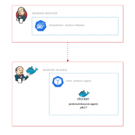

Jenkins is an open source tool, programmed in java, which offers us a wide plugin manager, with which we can automate and integrate efficiently and quickly.

Below I show you a list of tasks that we can do with Jenkins, as well as the plugins that help us make it easier to do:

- Building applications (Maven, npm)
- Static code testing (SonarQube)
- Application Deployment (Kubernetes)

### Architecture Lab
In this laboratory practice, we will find a Jenkins server where we can perform our own automations:



Jenkins is composed of two nodes: the master node, which serves as our graphical interface for configuring and managing our automations/pipelines, and the slave nodes, which are responsible for executing the pipelines.

### Jenkins Website:

Open firefox browser and write the following URL:

```shell
http://jenkins.onlylabs.io 
```
Your user:
```shell
admin
```
Password:
```shell
admin
```