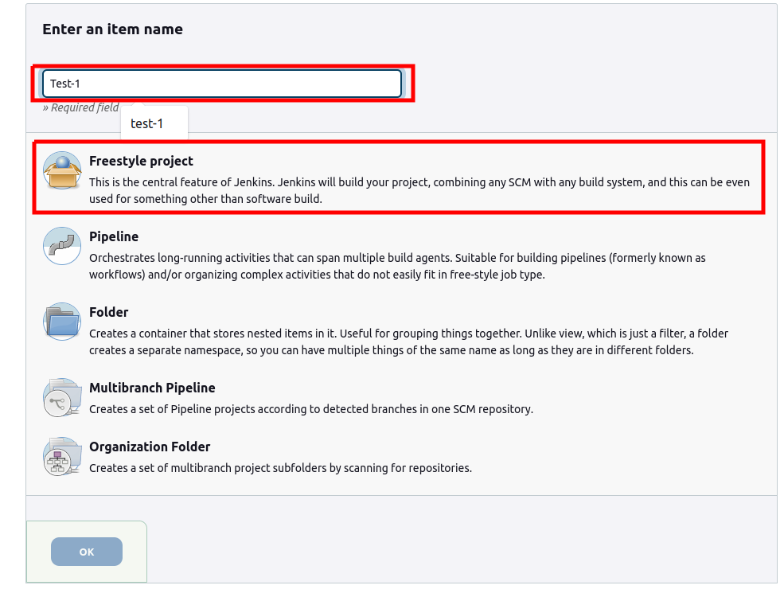
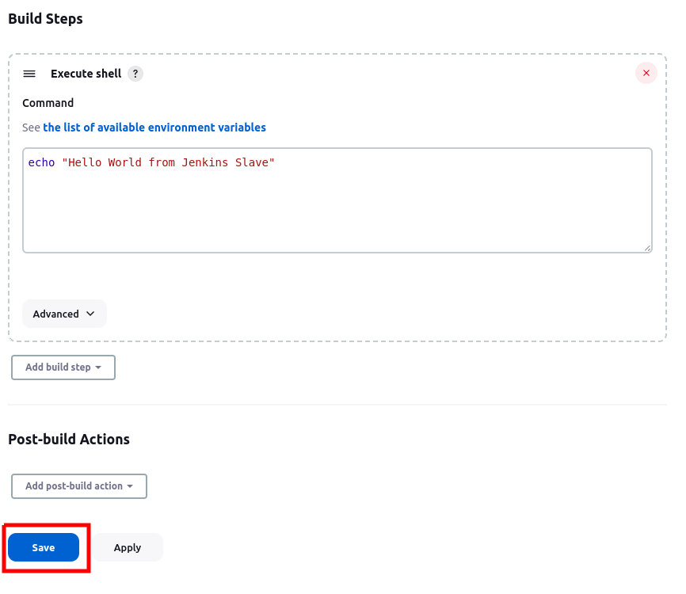
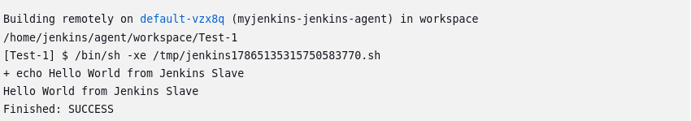

In Jenkins website you will find the main dashboard where we can see all the pipelines.

You will create your first pipeline by clicking on "New item" or "Create a job".


You will start by creating a freestyle pipeline, which is the most widely used and allows you to create processes with its graphical interface or through configuration files.

This time you will do it from its graphical interface.

Enter "Test-1" as a name and select "Freestyle Project":




- Go to "Build steps" select "execute shell".
- Enter the following command.
```bash
echo "Hello World from Jenkins Slave" 
```
- Click on "save"



Congratulations you created your first pipelines in Jenkins.

Now on the next screen, you are in the pipeline, here you can see a history of all the pipelines with their different states:

- Successful
- Failed
- Pending
- In progress

Click "Build Now"¹  to run your first pipeline and wait for it to complete.

When executing a pipeline, jenkins creates a new instance of a "jenkins slave", we can say that it creates a temporary computer, only to carry out the commands and/or processes that you need.

Once you have successfully executed your first pipeline, click on that execution².


click on "Console Output".

There you can see step by step how your pipeline is executed.

At the end of the records we should see how the previously configured command is executed.



This is how we create an automation with Jenkins.