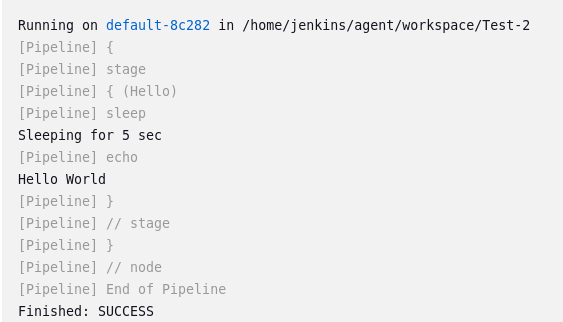

To know how to add different configurations/tasks in a jenkinsfile, go to pipeline "Test-2", then click on "pipeline syntax".


On this screen you can interactively see how to configure agents, stages, tasks, how to use different plugins, etc.

click on "sample step", here you will see everything you can do from a jenkinsfile.

select "sleep" set it to 5 seconds and click "Generate Pipeline Script".

It generates the command for your jenkinsfile:

```bash
sleep 5
```

Go back to configure your "Test-2" pipeline.

Go back to configure your "Test-2" pipeline and add the new command in the steps of your jenkinsfile, like this:

```bash
pipeline {
    agent any

    stages {
        stage('Hello') {
            steps {
                sleep 5
                echo 'Hello World'
            }
        }
    }
}
```
Save and run again.
As you can see, now it waits 5 seconds to execute the "Hello World", this is how you can add new steps to the jenkinsfile.

