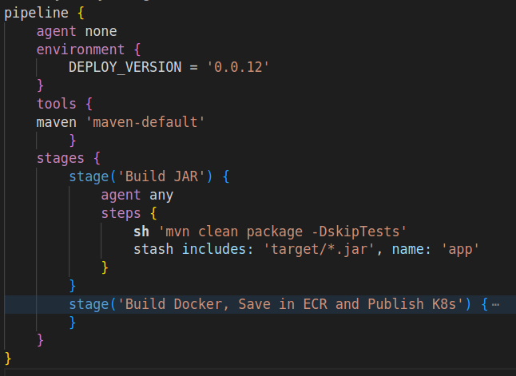
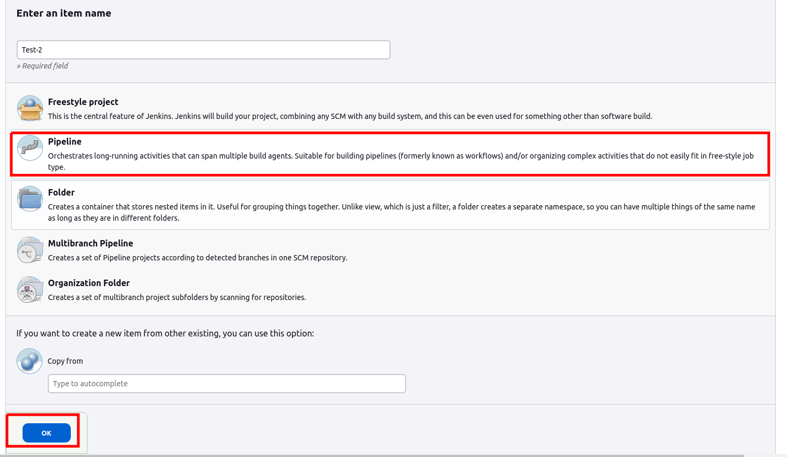
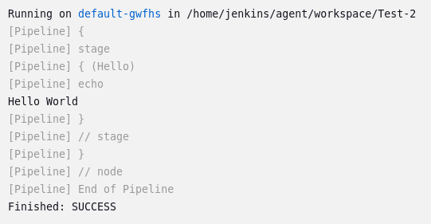

Now you will create the pipeline using a jenkinsfile

A Jenkinsfile is a configuration file written in code that defines and describes how a software project should be built, tested, and deployed using Jenkins. Contains step-by-step instructions that Jenkins follows to automate the entire development lifecycle, from initial build to final deployment.

The Jenkinsfile is usually stored in the project repository along with the source code.

This is a jenkinsfile example:

```shell
pipeline {
    agent none
    environment {
        DEPLOY_VERSION = '0.0.12'
    }
    tools {
    maven 'maven-default' 
        }
    stages {
        stage('Build JAR') {
            agent any
            steps {
                sh 'mvn clean package -DskipTests'
                stash includes: 'target/*.jar', name: 'app' 
            }
        }
        stage('Build Docker, Save in ECR and Publish K8s') {
            agent { 
                label 'dind-agent'
            }
            steps {
                unstash 'app'
                sh 'sleep 15'
                script{
                    
                    app = docker.build("docker-image-name")
                    docker.withRegistry('url-ecr-registry') {
                    app.push("${env.DEPLOY_VERSION}")
                    app.push("latest")
                    }
                sh 'curl -LO "https://kubectl.com"'
                sh 'chmod u+x ./kubectl'  
                    withAWS(credentials: 'aws-credentials', region: 'us-east-1') {
                        script {
                            sh "./kubectl apply -f k8s.yml"
                        }
                    }
                }
            }
            
        }
    }
}


```

create a new pipeline with the name Test-2.

This time select "Pipeline" and click ok.



Now go to the "pipeline" section, click on "try sample pipeline" and select "Hello World".

you should see this jenkinsfile:

```shell
pipeline {
    agent any

    stages {
        stage('Hello') {
            steps {
                echo 'Hello World'
            }
        }
    }
}

```

Congratulations you created your first jenkinsfile pipeline in Jenkins.

How does the jenkinsfile structure work?

- pipeline
  -  Defines a new Jenkins pipeline.
- agent any
  - Specifies that the agent can be any available node to execute the pipeline job. 
  - This allows the job to run on any node in the Jenkins cluster.
- stages
  - Defines the stages of the pipeline. In this case, there's only one stage named "Hello."
- stage('Hello')
  - Defines the "Hello" stage. This stage will contain a set of steps to be executed.
- steps 
  - Defines the steps to be executed in the "Hello" stage.
- echo 'Hello World'
  -  step that prints "Hello World" to the console output of the job.

In summary, this Jenkinsfile creates a pipeline with a single stage named "Hello," which prints "Hello World" to the console output when executed.

save the pipeline and run it.



As you can see, we perform the same task as the previous pipeline, but configured from a jenkinsfile.


